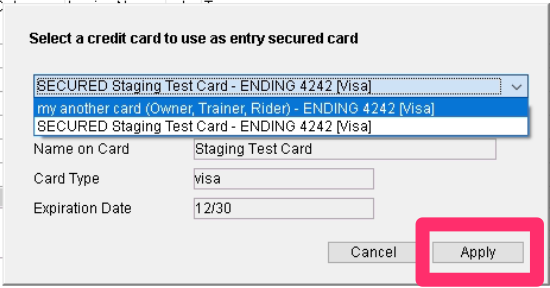
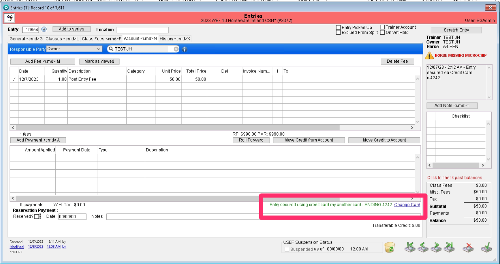
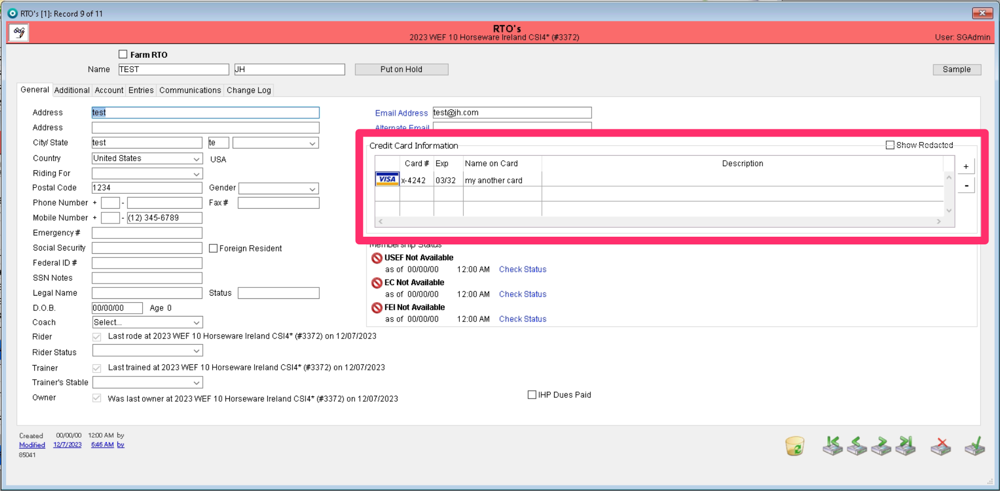

# 💳 Changing the Credit Card Used to Secure Entry

## How To Change the Secured Card

Each entry that comes into the office from the web shows in the Account Detail tab, the specific card that was used to create the entry. Now we have added the option to be able to change that secured card. We have also added the option to choose the secured card on manual entries created in the office.&#x20;

<figure><figcaption></figcaption></figure>

Now users will notice a Change Card button next to the secured card description. The description for the secured card will show the name on the card, the last four digits, and the expiration date.&#x20;

<figure><figcaption></figcaption></figure>

Pressing that Change Card option will bring up a box to select a new card.&#x20;

<figure><figcaption></figcaption></figure>

The available cards in the dropbox come from the cards associated to each person's RTO account. Each card will list which RTO on the entry it is associated to. This card for example is associated to the Owner, Trainer, and Rider because this person acts as all three on the entry.&#x20;

<figure><figcaption></figcaption></figure>

Once you have chosen the new card you want as the secured card, the card information will update in the provided areas. You must hit apply to change the card.&#x20;

<figure><figcaption></figcaption></figure>

Once you have completed this, your entry's secured card will now show the updated card.

<figure><figcaption></figcaption></figure>

To completely save your changes, you must save the entry record.

<figure><figcaption></figcaption></figure>

### Applying Card Changes to Entries in Series

If the entry that the card is being updated for is entered in multiple shows in a series, the user can choose to update the card for that entry in all of those series' shows.&#x20;

When the entry is entered in multiple shows and the user chooses to change the card, the system will inform the user that the entry the number of entries in the show series it will be changed for.&#x20;

<figure><figcaption></figcaption></figure>

If the user only wants to change the card for one show, hitting cancel in this box will only update the card for this particular show.

If the user does want to change the card for all entries, hitting ok will update the changes across all of the entries.&#x20;

### Expiration Date

We have added a check system for cards to ensure that the card does not expire before the end of the show.&#x20;

If a card is set to expire before the end date of the show, the system will alert the user that the card cannot be used.&#x20;

<figure><figcaption></figcaption></figure>

This check is also ran when updating a card for entries in series. If the card is set to expire, it cannot be updated.&#x20;

### Important Information on this New Tool

1.  Credit cards cannot be added to the change cards option. If the card you want to select as the secured card does not show in the available list, you must add the card to the person's RTO record.&#x20;

    <figure><figcaption></figcaption></figure>

2. This is currently an option that is allowed to be used by users in the Secretaries and Administrators groups.&#x20;
