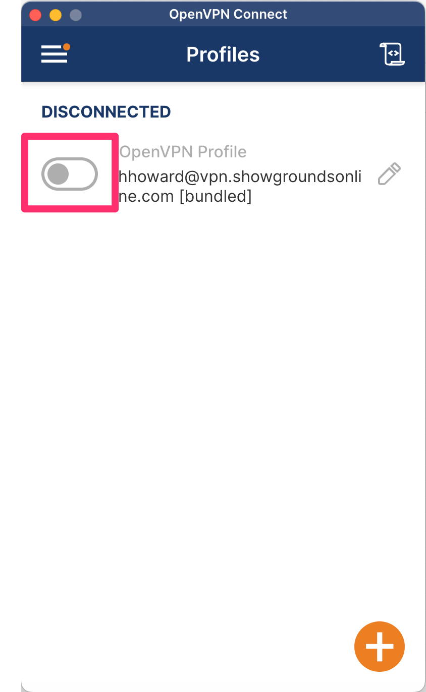
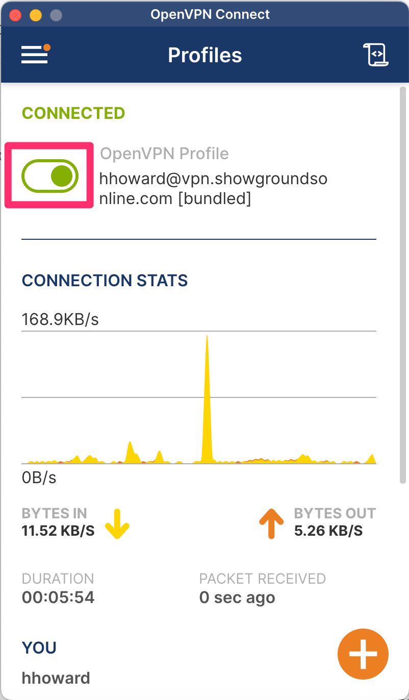
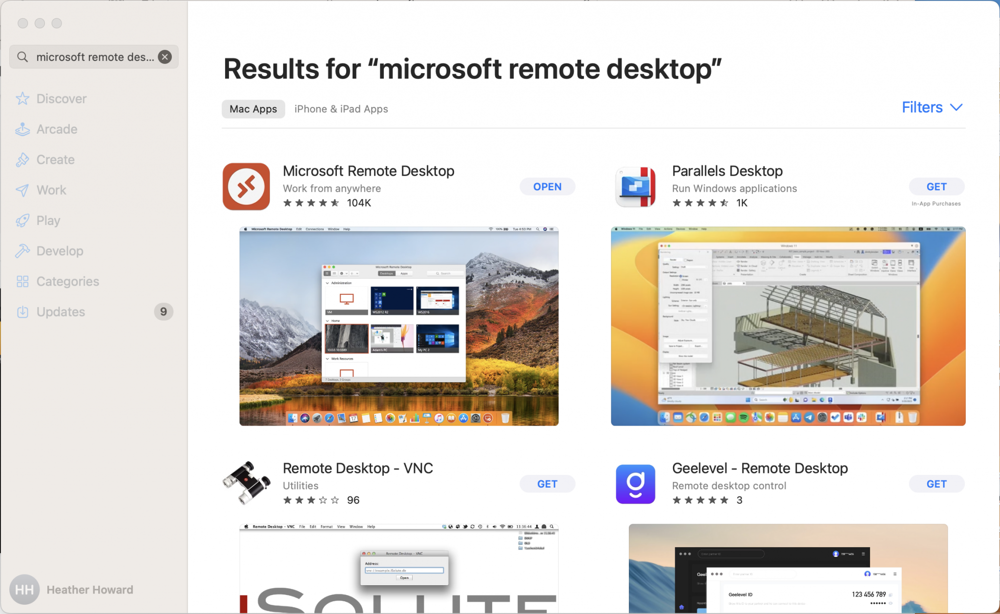
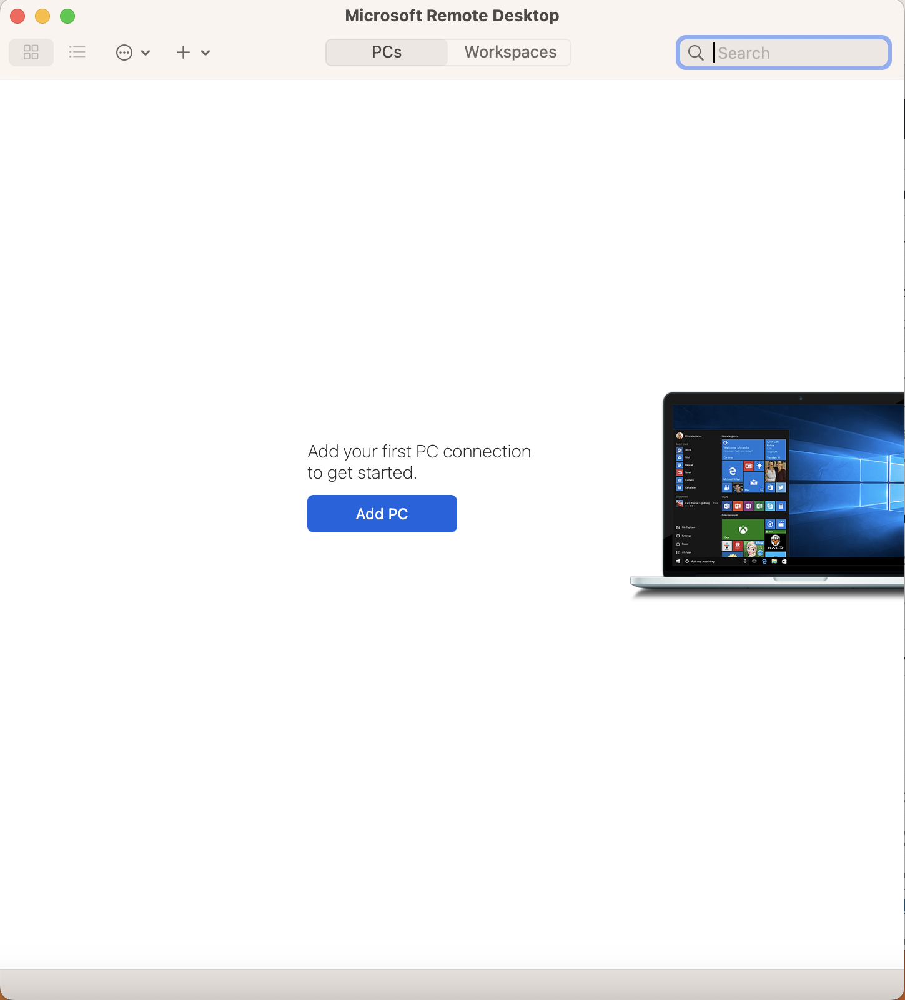
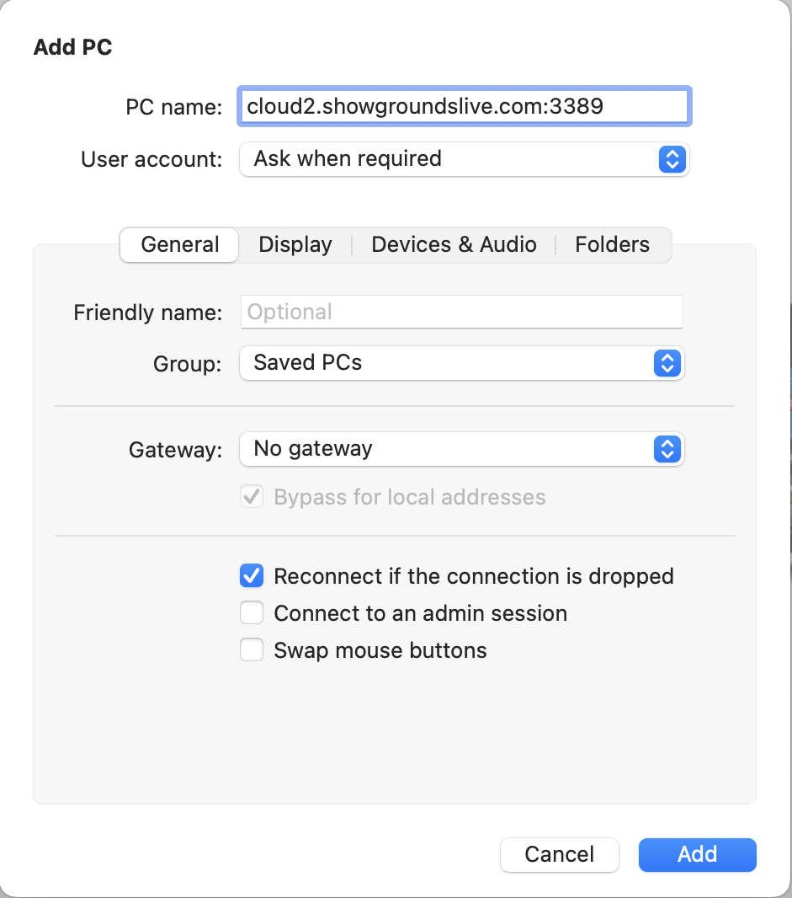
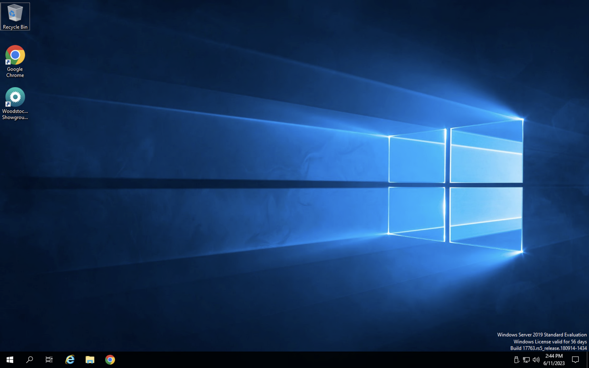

# VPN and Remote Desktop Connection

## Overview of VPN

What is a VPN? VPN stands for Virtual Private Network. This is a mechanism for creating a secure connection between your user computer and the server network.&#x20;

The VPN is a recent addition to add an extra level of security to the information that is stored in the software database.

To now connect to the Remote Desktop Connection, users will need to enable their VPN first. The following steps will walk through how to turn on and turn off your VPN.&#x20;

### Enabling and Disabling Your VPN

#### Enabling the VPN

1. To enable your VPN, you will open your VPN icon.&#x20;

<figure><figcaption></figcaption></figure>

2.  You will see the following screen when you open your VPN.&#x20;

    <figure><figcaption></figcaption></figure>

3.  To turn on the VPN, you will click this button.&#x20;

    <figure><figcaption></figcaption></figure>

4.  You will be prompted to enter your password. Your password that is used here is also the password you use for the Remote Desktop Connection.

    <figure><figcaption></figcaption></figure>

5.  Once you have entered your password, it will load for a second and then the screen will show that you are connected.&#x20;

    <figure><figcaption></figcaption></figure>

    Once you are connected on the VPN, you can then access the RDP connection. For directions on connecting to the RDP connection, click [here](vpn-and-remote-desktop-connection.md#overview-of-remote-desktop-connection).&#x20;

### Disabling the VPN

When you have completed your session in the remote desktop, you will want to turn off your VPN. This is done by hitting the same button that turned the VPN on.&#x20;

<figure><figcaption></figcaption></figure>

The VPN will ask you to confirm the disconnection.&#x20;

<figure><figcaption></figcaption></figure>

Once you have hit confirm, your VPN will be disconnected.&#x20;

<figure><figcaption></figcaption></figure>

##

**It is important to note, the steps with the VPN will need to be done before and after every remote connection is made. If you do not turn on the VPN before trying to connect to the Remote Desktop, the connection will not load and you will not be able to log in.**&#x20;

<figure><figcaption>
This screenshot shows the user trying to connect to the RDP without the VPN turned on. It will not work unless the VPN is turned on. 
</figcaption></figure>

## Overview of Remote Desktop Connection

If you’ve been instructed to use Remote Desktop these are basic instructions for setting up your connection.&#x20;

<mark style="color:red;">\*Whether you are using a Mac or a PC, your computer or host name will always be:</mark> cloud2.showgroundslive.com:3389

#### Setting up Connection on Windows

1. Go to Windows Start Menu and click once
2. Start to type “Remote Desktop Connection”.  When it appears select it and launch the program
3. Enter the IP address or host name of the server your connecting to.  In this case “cloud2.showgroundslive.com:3389”\
   
4. Click “Show Options” to expand options
5. Enter the username you’ve been provided in the username field.\
   IMPORTANT: if a domain name has been provided enter that first followed by a backslash\
   Example:  \domain\_name\username
6. Check the box “Allow me to save credentials”
7. Select “Save As” and save a copy of your connection information to a convenient location such as the Desktop.  Give the connection a name that makes sense and you will remember (i.e. ShowGrounds Connection)
8. Once save you may click “Connect” to start the Remote Desktop session.
9. You will be prompted for your password, enter what was provided and select save password.

&#x20;

#### Setting up a Connection on a Mac

There are two different options for accessing the Remote Desktop Connection on Macs. You can either use Microsoft Remote Desktop or Jump.

**MICROSOFT REMOTE DESKTOP**

To use the Microsoft Remote Desktop program, you will need to go to your App Store and search for Microsoft Remote Desktop.

Once you have the program downloaded to your computer, you will be prompted to add the new computer you are wanting access to.

When you click the Add PC button in the center of the page, a page will show up for you to add your computer’s host name. Once you have entered the name into that space, You can click the add button at the bottom to add the computer to your list.

The computer is now added to your list of accessible computers. You can double click the computer to connect. You will be brought to a login page. This is where you will input your RDP credentials that we give you.

&#x20;.png>)

Once you have entered those credentials, you will be able to access the Client program.

**JUMP**

You will need to purchase and download Jump on your computer if you have not already.

Once you are in jump, there is a plus sign on the top menu, click that to add the RDP connection.

That will open up this box to enter the information for the computer.

The connection you want is RDP.

Your host name is: cloud.showgroundslive.com

Once you enter that, it will show up on that main screen. When you go to open it the first time, you will have to log in with whatever the correct credentials are.

&#x20;

#### Setting up Printers on a Remote Desktop Connection

**Mac info**

When you open Jump and hover over the connection box, select the dots in the top right corner of the box.

From there, Click on “Sharing”

The choose the default printer. For one printer, select the printer name, for multiple printers, select the “send to preview to mac” option and you will then be able to select which printer you want to use that way when printing.

&#x20;

**PC info**

When logging into your Remote desktop connection, select the “Local Resources” tab on the top.

Make sure the printers button is checked, and you will then be able to select whichever printer you want to use during your session.
