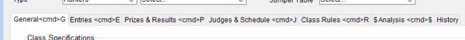

# Classes Detail View

## Detail View Common Functions

All detail screens share some common elements. To review these common items please click here.

## Overview

The section above the tabs stays the same regardless of which tab you’re selecting.

Class number – The class number can be any value but must NOT have any letters as part of it.  If you need to change a class number after having saved it you must first click the “Lock” icon to unlock the field for editing.

### USHJA Qualifier Class

If you have a class that is operating as either “Ranking List” or “Young Jumper Qualifier” you must check the box to enable the USHJA Qualifier.  Once you’ve done so select which type of qualifier the class is part of.  You also enter the class number to be used for the qualifier.  This class number will be used in the results file sent to USEF.  It must not be the same as any other class in the show.  Results of the main class will be reported in the Qualifier class as well.  In this example the main class is 806 and the results will be reported for that class as well as for class 999 (the qualifier class.)

### Classes With Multiple Jump Heights Offered&#x20;

\*Please note this is ONLY for classes that offer multiple jump heights. This is NOT applicable to combined classes. For combined classes, please use the combine feature.

As pictured below, the there are two relevant fields for jump height - "Fence Height" and "Heights".

<figure><figcaption></figcaption></figure>

In the “fence height” field, you may enter one of the jump heights offered for the class. This will be the default if no specific height is selected for the entry. In order to indicate that the class is to be run at multiple heights, the user should enter the heights in the “heights” field in INCHES ONLY separated by commas in the new field as seen above. For example, a class that is to run at 2’9 and 3’ MUST be entered in the new field as follows: “33, 36”.

&#x20;“2’9, 3’” would NOT be a valid entry.

The user should then navigate to the class in question. In the entries tab, upon clicking on the fence height field, the user will see a drop down for each entry. To continue with the example above, the dropdown will have the options of “33, 36” to indicate which height that entry will jump. Select the correct height for each entry.

<figure><figcaption></figcaption></figure>

## Tabs

## General

Class Specifications

Horse Requirements

Rider Requirements

## Entries

List of Entries in Class w/ Order of Go, Entry Number, Horse + RTO

## Prizes & Results Tab

### Placing Template

### Verify Roster

The Roster Verification button should be the first step in entering results from a judges card.  This process helps to identify any entries that may have gone in the classes but hadn’t signed up for it previously or any entries that were signed up but did not compete.

To Start this process click the Roster Verification button

Step 1: Enter each entry number that appears on the judges card.

#### Riders Not In Class

If you enter an entry number that had not been entered in the class the computer will beep and this text will appear indicating that the entry was not previously entered.  You may select the rider add the entry to the class.  If a “bandit” fee has been setup for entries that appear on the judges card having not entered, then this fee will be added to the entry as well.  Please note the riders “Status” will be visible as well to assist in making the selection.

### Changing Results after prize money has been applied

If results have been entered for a class and prize money has already been applied but you need to correct a mistake, then follow these steps.

At the bottom of Winner’s # column you’ll see “Select Prize Money Action”

Select **Rollback Applied Prize Money**.

You will now have the ability to click on the numbers you entered in the placings & edit them per your corrected results. After that you will need to “**Apply Prize Money**” (from the same drop down pictured above) to ensure that the prize money is distributed correctly.

As with existing requirements, the user may select “warn” to warn a user that the horse does not fit the requirements to be in the class or select “disallow” which will produce an error message and will not allow the entry to be added if it is outside of the requirements.

<figure><figcaption>
Class added WARNING.
</figcaption></figure>

<figure><figcaption>
Class NOT added/ disallowed.
</figcaption></figure>

### Entry Verification Against Rules

To verify entries by the horse height is run in the verification process. The choice for Horse Height is found in the Horse Requirements section of the Verification window.&#x20;

<figure><figcaption></figcaption></figure>

Select Horse Height as the requirement and click continue. Green/verified entries are those that fit the requirements OR are not in classes with the requirements. Red/unverified entries are those that do NOT fit the specified class requirement.\

<figure><figcaption></figcaption></figure>

##

## Judges & Schedule

## Class Rules

### Horse Height Rule

This documentation walks through how to set the class rules correctly for the Small Junior Hunter and Small Hunter Height Requirements.

In the class detail, users are able to set a Horse Type (S/M/L pony, S/L horse) OR set a height range for Horse Height. **Please note that ONLY ONE of these preferences can be set per class.**

<figure><figcaption></figcaption></figure>

## Analysis

## History

Record of any changes to Class record
