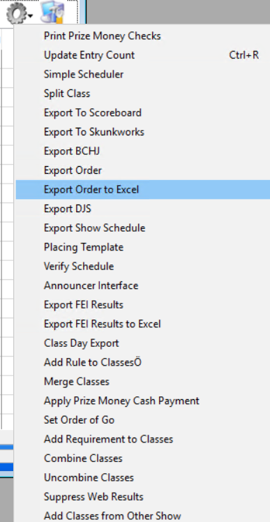
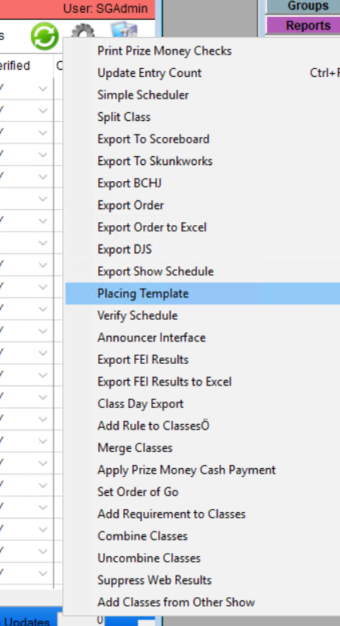
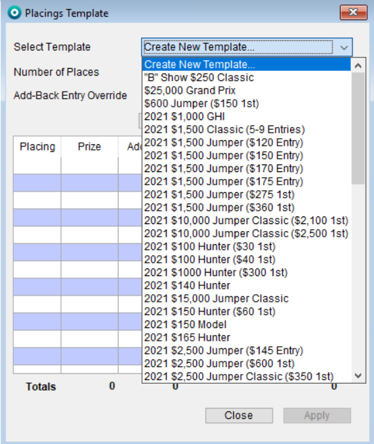
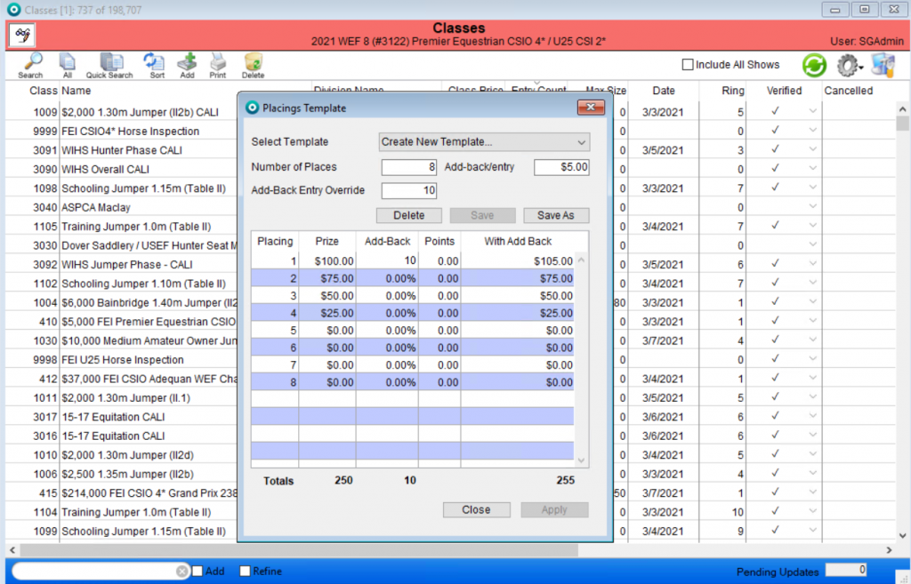

# Classes List View – Quick Actions

## Print Prize Money Checks

## Update Entry Count

## Simple Scheduler

Read more about how to set up the Simple Scheduler [here. ](simple-scheduler.md)

## Split Class

## Export to Scoreboard

## Export to Skunkworks

## Export BCHJ

## Export Order

## Export Order to Excel

Under the quick actions wheel select “export Order to Excel”

<figure><figcaption></figcaption></figure>

Once the user has selected that, the following box will appear. Choose the location you wish to save your report in.

## Export DJS

## Export Show Schedule

## Placing Template

Under the quick actions wheel select “Placing Templates”

Once the user has selected that, the following box will appear.

Select the “create new template” option.

The user will then be able to fill in the following fields.

The user can select the number of prize money recipients by filling in the “Number of places” box.

The user can also add the number of Add-back entry riders and the Add-back/entry fee.

From there, the placing boxes will auto populate and all the user will need to do is fill in the Prize Money mount, Add-back percentage and the points for each placing. The far right column will appear with the total amount after the prize money and add-back money is calculated.

Once the user has input all the desired information, click the “Save As” button, and the following box will appear.

Once the user has named the template, select “save” and the template will be available for use.

## Verify Schedule

## Announcer Interface

## Export FEI Results

## Export FEI Results to Excel

## Export EC Results

## Class Day Export

## Add Rule to Classes

## Merge Classes

## Apply Prize Money Cash Payment

## Set Order of Go

## Add Requirement to Classes

In the class detail screen, users are able to add requirements for the specific class. Here, the user can add or remove class requirements in bulk.

First, select the classes you want to set requirements for by using the search bar.

Next, go to the wheel on the right side of the list view, and select “Add Requirements to Classes”

A dialog box will appear where the user can select the desired requirements for both Horse and/or Rider for the selected classes.

Once the user selects the requirements and clicks “Add” a status bar will appear on the top left.

Users may also use this tool to clear classes requirements for the selected classes.

When this option is selected a warning will appear

To proceed, click “OK”

## Combine Classes

Select the classes you want to combine from the list view, and then the Combine Classes option from the Quick Actions menu

A dialog box will appear showing the classes you are combining as well as the new class number, if you want to change it.

A warning will pop up for the user

Then the list view will show your combined class. If you double click on the combined class it will show you the details of the combined class.

Show administrators will also have the ability to uncombine the classes.

**NOTE**: The entry verification process will use the **original class rules** for the combined classes. USEF Results for Combined Class now shows the Fence Height from the original Class.

In the IOS app and on the Web, when adding entries and doing a class add/drop, we are not allowing the users to enter into the current combined class or division. They can only enter in the original class/division.

## Uncombine Classes

## Suppress Web Results

## Classes With no Results

This option will generate a list of classes with no entered results.

## Add Classes from Other Show

This option can be used to import classes from previous shows into the currently selected show. First, make sure that you are in the show you want to import the classes INTO from a previous show, and then select the quick action.

A dialog box will appear where the user can select the show from which the classes will be imported from.

There are three ways to select the classes the user wants to import.

* Enter the classes by class number in the search bar under the Source Show
* If the user wants all of the classes from the Source Show then select the Select All Classes option
* Selecting the classes individually by checking the boxes on the left hand side column.

Once the classes are selected that the user wants to import, select Import.

### Notes about Imported Classes

1. After classes are imported from another show the class in the current show will note in the history that it was imported form another show.
2. Classes are imported with the same class number. In the case of a conflicting class number, the next highest available class number will be assigned to the class.
3. Class requirements, class rules, and class prize templates are all included with the information that is imported.
4. Combined classes are imported as Non-Combined classes. No class groups are created with the imported classes.
5. Imported classes are assigned ONLY to the same division in the show process.

