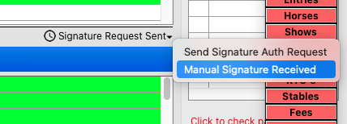

# Entries Detail

## Detail Page View

The Detail Page View is what you get when you select and double click an Entry from the list view

## General Tab

### Linked Accounts

When RTO records are linked to a ShowGroundsLive login, it will be indicated in the line at the bottom of each window, along with the email address and phone number associated with the account, as well as the status of any outstanding digital signature requests for the entry.

### Confirming Receipt of a Digital Signature

In conjunction with the collection of digital signatures, we are displaying the verification of them in the Entry Detail

When a signature is not yet present the show office staff can request it.  This sends the link to the phone number indicated in the request detail window as seen below:

This number will present whether it is verified or not –

### Confirming a Manual Signature

If a paper signature is received then the user can notate that on the account. In the General tab, select the dropdown under “Signature Request Sent” and

<figure><figcaption></figcaption></figure>

A warning will appear for confirmation.

Once the user clicks OK then the RTO record will now show Signature Obtained

### Applying a Signature to a Series

If the manual record is received for an RTO that is in multiple shows in that series, then there will be an option to use that signature for all shows in that series.

If selected the signature is replicated to future shows of the series.

### USHJA Integration

Recently, USHJA made the decision to separate from USEF so we have been working to integrate with their new system so that Show Companies can track USHJA memberships. This will work the same way that USEF, EC, and FEI membership checks work.

In the entry detail screen, USHJA membership will now be listed for all parties associated with an entry.

Also like the other membership organizations, if the USHJA membership is NOT valid – eg up-to-date – then it will show in red.

If an exhibitor qualifies for an override, the user can then double click on “USHJA”

The dialog box for the temporary override will appear.

Once the override is set, the USHJA number will turn orange to indicate that there is a temporary override in place.

_NOTE: If the user double clicks on the USHJA logo, the system will run a check on the current membership and update it accordingly._&#x20;

##

####

### USEF Membership Dates

Since we have the last membership start and end dates, we can update invalid membership dates. This will make sure that an invalid membership never shows as green.&#x20;

<figure><figcaption></figcaption></figure>

We have also added the option to copy/paste from the membership record. This allows users to copy the membership number or any other information they need and transfer to another area.&#x20;

<figure><figcaption></figcaption></figure>

## Classes Tab

### Scratch Option

There an option to scratch classes from within the all classes tab within an entry. Highlight the class to be scratch and click the scratch button.

On clicking the button, the user is asked for confirmation. Click OK.

We have also added a “Scratched” column to display scratched status for trips on the “All Classes” tab.

This process can be done in reverse as well by highlighting a scratched class and clicking “Unscratch.”

## Account Tab

### Adding Trainer Stall Inventory

If you are requiring a stall reservation for an exhibitor to enter a show, you may find that you need to add stalls manually to the trainer’s account which you do from the Account Tab in the Entry Detail View

To add to the Trainer Stall Inventory, open the Trainer Record from the Entries window, and click ‘Add Fee’:

From here, choose either Premium or Regular stall:

Enter your desired quantity in the appropriate field, and the ‘Trainer Stall Inventory’ box will appear. Check this box, and click ‘Execute’ to add to the account.

For each entry, if no stall is manually added, one will be deducted from the attached trainer’s inventory, as noted in the lower right:

Alternatively, if a stall _**is**_ manually added to the entry, the opposite message will appear:

### Modify Trainer Stall Inventory

In the event that Trainer Stall Inventory needs to be adjusted, open the trainer entry and navigate to the ‘Account’ tab:

Double-click on the existing Trainer Stall Inventory record:

Uncheck the box marked “Trainer Stall Inventory”:

The below prompt will appear – select **‘Yes’** and the inventory will be removed.

### Adding a Show Fee to an Entry

Adding a Show Fee to an Entry is done from the Entries module. Start on the Entry list view

Select the Entry by double clicking it from the list and the detail screen will appear for that Entry.

Select the “Account” tab on the top. This tap will display all fees currently associated with the Entry.

Then select the “Add Fee” button.

A dialog box will appear and from there, the user can use the dropdown list to locate the fee they are adding to the Entry.

Once the user has selected the fee, and input the quantity for the fee, it will look like this. The invoice number field can be used for any internal reference number you may have (for instance if entering from a paper receipt of some kind)

Once the user has verified all information is correct, select the “Execute” button to add the fee to the entry. This box will then update confirming the Show Fee has been added to the entry.

**\*Note, the box will not close so users can continue to add Show Fees easily. Once complete, select the “Done” button and the box will close.**

After the user has completed adding the Show Fee, it will show in the Entry’s account history.

## Removing a Show Fee from an Entry

Removing a Show Fee from an Entry is easy. Under the Entry’s Account tab, select the Show Fee the user wishes to remove. Then select the “Delete Fee” button in the top right corner.

This box will appear prompting users to input the reason why the fee is being deleted.

Once the reason is entered, select the “Ok” button and the fee will be removed from the Entry and will no longer show in the Entry Account history.

