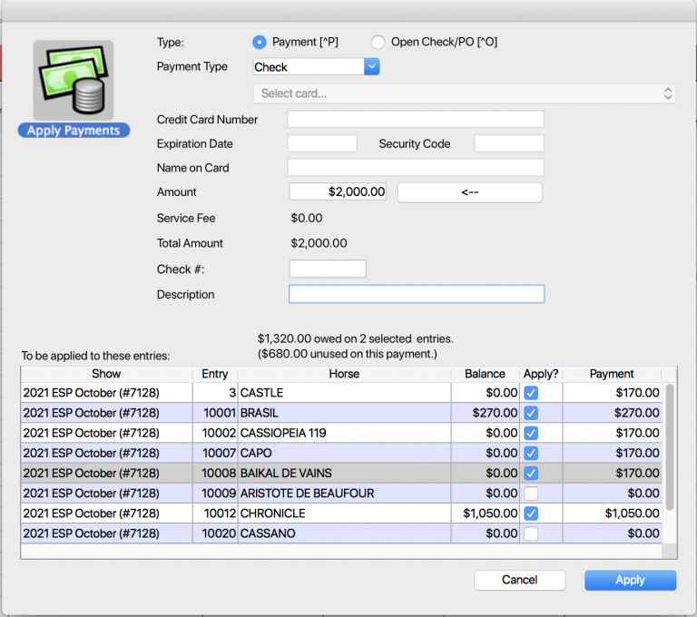

# Entries List View – Quick Actions

## Overview

In the list view of the Entries Module these are the Quick Action options if you select the wheel icon on the top right of the list view.

## Apply Payments

The Apply Payments quick action enables users to apply payments to multiple entries across multiple shows.

Users can select the checkbox to “Include All Shows” and then select their subset of Entries. From the wheel select “Apply Payments”.

A dialog box will appear and by default none of the Entries will be selected.

Select which Entries you want to apply the payment to by checking the box in the second to last column.

Once the Entries are selected, the user can select how they want to make the payment from the dropdown for Payment Type

Next, click on the arrow on the line that reads Amount. This will calculate the total amount for the Entries selected.

Last, select Apply.

There will be a progress bar that appears on the top of the screen and then after completion the Entries will now read $0.00 under balance and the words Payment Successful will show in green on the bottom left hand corner.

Once the user has paid the desired entries they can close the window by selecting the “close” button.

\*Note, users have the ability to select the entries with $0 balance to apply the payment. When the user selects the entries with no balance, the unapplied amount gets equally distributed in the selected entries.

## Apply Prize Money

Learn more about how to apply prize money[ here](http://docs.showgroundsonline.com/doc/showgrounds-manual/misc/#8895)

## Rapid Class Add/Drop

Rider Status is added in Roster Class Add/Drop

## Assigning Entry Numbers to Web Entries

We have added the ability to bulk update Entry Numbers using the quick action wheel.Entries must be selected first to utilize this tool.

The user will input the starting entry number.

&#x20;_Note: if the starting Entry Number already exists, the user will receive an error message._&#x20;

The Entry Numbers are assigned sequentially from the users inputted starting number. If there is a number in between tat is already assigned then the entry will be the next available number. Entries of the same horse in future shows are also updated if the entry number to assign is available in that show.

Entry numbers are logged in the Change Log

### Update Memberships

Users can update in bulk for USEF, EC, & FEI memberships of Horses and RTOs. Simply select the entries that you wish to update and then select Update Memberships

## Add Location

Users have the option to add Location to multiple Entries at a time, for internal reference.

A warning will pop up, asking if the user is sure they want to change the locations for the number of Entries they have selected.

Set the desired location.

The user will then receive a confirmation that the action has been completed.

A column has also been added in the Entries list view for Location.

### Transfer Balance

The balance transfer tool allows the arbitrary transfer of either an existing balance (money owed by entry) or a credit balance (money owed to entry) from that entry to 1 or many other entries.  The balance transfer tool will ONLY create a transaction that balances to a zero, meaning the sum of all the distribution amounts must equal zero.

Select the entries that will be involved in the transaction.  This would include the entry from which the balance is being transferred as well as those to which the balance will be transferred.  If the user does not start with a selection they may still bring up the tool and enter both the source and destination entries.

On the next screen enter the entry number

Enter the amount of money to be transferred and other information.

\*IMPORTANT – A positive value will cause the source entry’s balance to increase, while a negative value will cause it to decrease

You may customize the description or leave blank for at the default description

This amount will be evenly distributed between the other entries by default.

You can edit this amounts as needed, for example

NOTE – The entry from which the transfer is being done should be excluded from the transaction

NOTE – The transaction must add up to zero in total, if it does not you will see a warning like this and won’t be able to complete the transaction

You may add additional entries to the transaction from the tool by entering the entry number here

Step 5 – Click apply to complete transaction

Once completed the resulting transaction will appear as a payment record on each of the entries included.  Transfers increasing a balance will appear with a negative value, while entries having their balance reduced will appear with positive values.

## Prize Money Checks

Select the Prize Money Checks option from the wheel in the entries window. From here, checks can be printed for entries with unapplied prize money.

## Set Membership Overrides

Set membership overrides is a feature that allows you to indicate that a particular membership should be consider as valid even though the membership data doesn’t indicate the membership is active. Examples might include a USEF member that joined at the show or an EC member that upgraded their membership for a single show.

Temporary Overrides can be done both in bulk and on an individual basis. This tool allows the user to set membership overrides on a series of entries at once. To read more about how to complete a Temporary Override on an individual basis click here. Below are instructions for the Bulk feature. (TBW)

This feature can be found in the Entries module under the Quick Actions option (The wheel). Select Set Membership Overrides.

> IMPORTANT – Before selecting this option please make sure you have the records selected that you want to effect. This feature will be applied to all entries currently in your selection.

## 4D - Override Field Updates

[**Made by Spencer Spevak with Scribe**](https://scribehow.com/shared/4D\_-\_Override\_Field\_Updates\_\_C4X3wC8CRX2iKW1Yu\_8OrQ)

Alert: Changes have been made for USEF and USHJA (both RTOs and Horses) to include a dropdown menu for override reason. The override reason and date will now be displayed.

1\. Double click to open the entry.

2\. In this example, the trainer does not have a USHJA #/membership. Double click the USHJA field to apply an override.

3\. The user may enter the override date (this will be displayed on the entry). As with before, if the "This show only" box is checked, the override is valid only for the current show.

4\. A dropdown with override options is located adjacent to Add Reason.

5\. Select the reason and click save.

6\. The USHJA field is now yellow to indicate an override has been placed. The date and reason also appear next to the organization.

7\. In this example, the trainer had a USEF membership number that was not current. An override was placed and shows as yellow; however, the reason and date do not appear as the membership number is retained and displayed instead.

[**Made with Scribe**](https://scribehow.com/shared/4D\_-\_Override\_Field\_Updates\_\_C4X3wC8CRX2iKW1Yu\_8OrQ)

If the Governing Organization is EC for the override, then **NOTE: Membership Level and the Reason Code (reason for the override) must be selected.** _If this is not implemented the results submission to EC will NOT be accepted._&#x20;

The user can also use this tool to clear any existing overrides for the selected entries.

Once the action of setting or clearing the override has been executed, an override summary dialog will display with all people or horses who’s memberships will be updated. By default all rows will be selected, however if the user decides they want to remove an RTO or horse from the list they can unselect the entry by unchecking the blue box in the left hand column. Once the user has selected the list of desired overrides, then they must click APPLY for the action to take place.

Any entry that has an override or a cleared override with this tool will show in the history.

**Note,** users can now search by temporary overrides in the entry.

## Export USHJA – Horses & RTOs

Under the Quick Actions wheel, users can export USHJA membership status one of two ways, by Horses, or by RTOs.

Select the location you wish to save the exported report to.

Once saved, the report will look like this.

Follow the same steps for the RTO export.

## Refund Credit Card Payments

Under the Quick Actions wheel, there is the option for refunding credit card payments.

To use this, you will need to make a subset of entries and then from the quick actions menu select the “Refund Credit Card Payments” option.

This window will appear with the subset of entries balances, and the following options.

**Refund Amount**: The total amount to be refunded based on the entries selected in this window.

**Refund Reason**: The user will be required to enter the reason for this refund. The reason is added in refund payment description.

**Remove Classes**: If checked, this option will refund the class fees from the selected entries. This is done to remove the class fee from the entries balance.

**Remove Entry Fee**: If checked, this option will remove all entry fees from the selected entries, except the credit card processing fee.

**Refund Credit Card Fees**: If checked, this option will refund the credit card processing fee as well and the fee is removed from entries. (Note: By default, credit card fee is not refunded from this tool, unless this option is checked.)

**Note,** In the Refund column, you can only select the entries that have any balance available to refund.

Once the user has selected the fees they wish to refund, they must hit the apply button in the bottom right corner of the window for the refund process to work. Once the refund has been issued, it will show in the entries history tab.

**Export Emails**

The first new export option is the export emails. This export will create a list of all of the emails associated to the entries in the list.

To access this export, you will go to the Entries module.

If you are looking for specific entries, you can search for those here and create your list of entries you want emails for. If you try to export from here, you will get emails for the people associated with all the entries on the list. In this example, we will look at one entry.

Once you have your list of entries, you will access the Quick  Actions Wheel. The Export Email option is at the bottom of the list of actions.

Clicking that option will bring up the following popup.

Once you click Yes, you can choose where you want to export the list to.

This is what your exported list will look like.

**Export Fee Paid Email**

This export is accessed the same way as the Export Email action, in the Quick Actions wheel. You will start out by going to the Entries module and access the Quick Wheel. This export action is the very last one on the list.

This popup will appear. You can add filters to your export in the form of year, the specific fee paid, and then the RTO role you want on your export. Multiple roles can be included in the export. For example, if you want your export to include both riders and responsible party, you would just click both boxes.

The popup of where you want to save the export will appear.

The following is what your export will look like and the information it will contain.

