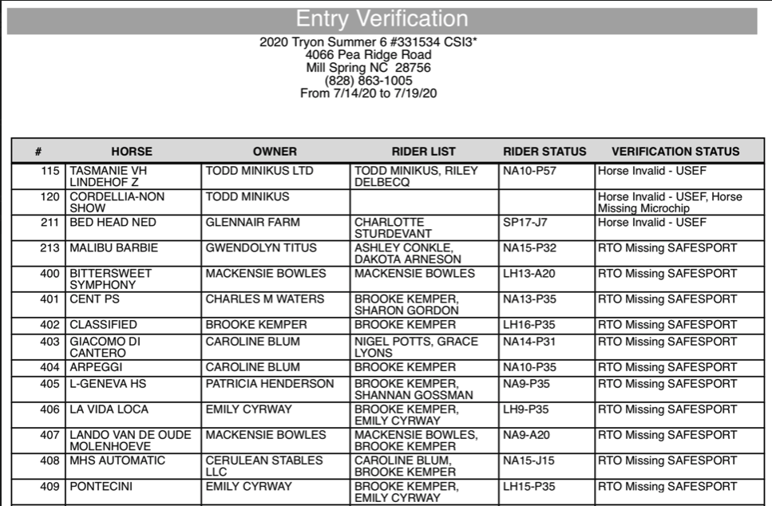

# Entries List View – Reports

## Overview

There are many reports for the entries module.  Below you will find a list of the reports and their behavior and output. You access these reports by selecting Print from the top of the list view.

##

## Invoice Report

First, navigate to the Entries Module. Select the entry (or entries) that you would like to pull invoices for. Click the "select" dropdown and then "Show Subset".

<figure><figcaption></figcaption></figure>

You will then see only your selected entry (or entries). Click the "Print" button and select invoice from the list. Your invoice (s) will then print.

<figure><figcaption></figcaption></figure>

## Trainer Add/Drop Report

To access this report select print from the taskbar at the top:

From within the “Print Entries Reports” dialog, you’ll find the reported titled ‘Trainer Add Drop Sheet’:

The report will be displayed as shown below: **NOTE**: This report prints based on current selection.

## Trainer add/drop with Class

To access this report select print from the taskbar at the top:

From within the “Print Entries Reports” dialog, you’ll find the reported titled ‘Trainer Add/drop w/class”:

The report will be displayed as shown below: **NOTE**: This report prints based on current selection.

## Entry Verification Report

This report will show, for the selected entries, what they are missing from verification settings. \*\*Note you must run the verification before printing the report.

<figure><figcaption></figcaption></figure>

<figure><figcaption></figcaption></figure>

## Trips of Day Report

The Trips of Day report is displayed organized by ring with a total score on the right hand column.

## Prize Money by Entry

## Feed Delivery Report by Trainer

The Feed Delivery Report by Trainer is a listing of all feed and delivery supplies associated with the trainers from the selected show.

## Prize Money by Entry Subset

Prize Money by Entry Subset can be found under the print button on the Entries Module. This report will print only the prize money for the subset of entries you have selected.

Once printed, the report will look like this and will be filled out with the entry number, placing, class name, rider and prize money won.

## Trainer Split Sheet

The Trainer Split Sheet is found in the list of reports in the Entries module.&#x20;

<figure><figcaption></figcaption></figure>

Choosing this report will give a break down of each trainer's associated entries and the supplies that were used or split between all of the entries.&#x20;

<figure><figcaption></figcaption></figure>
