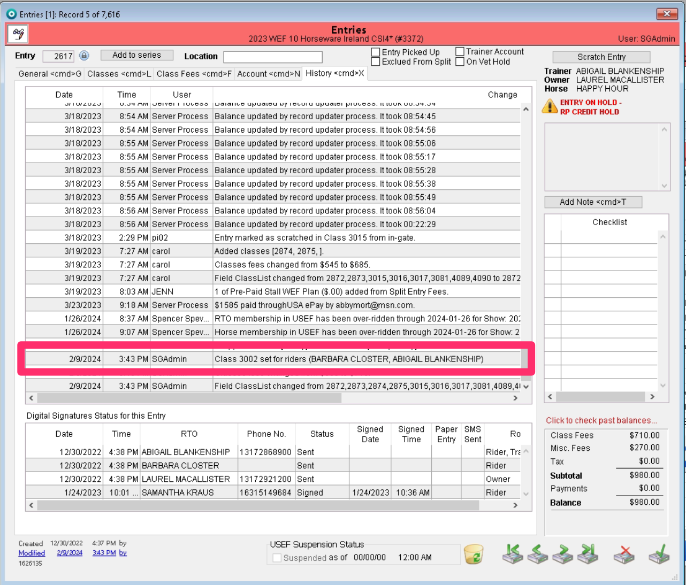
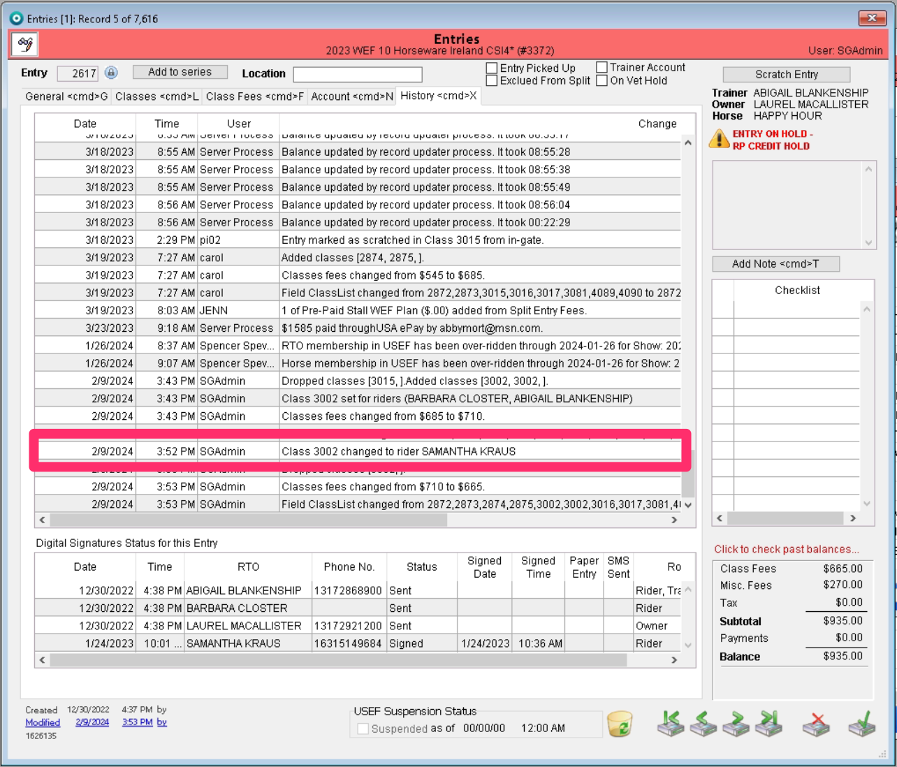
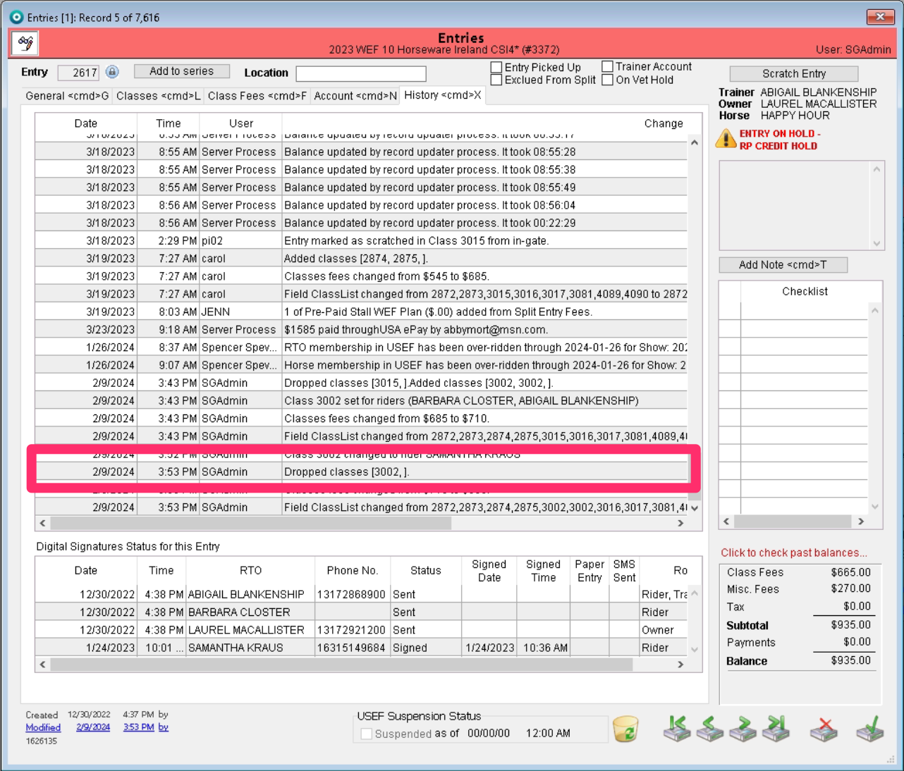

# Entry History for Multiple Riders

When an entry has multiple riders that are either entered in the same class, the rider is changed, or the same class was added for multiple riders and then dropped for any rider these changes will now show in the entry history.&#x20;

## Same Class Entered for Multiple Riders

When multiple riders are entered in the same class, the history will now show that class number with both riders.&#x20;

That history entry will show the class number with both riders names listed.

<figure><figcaption></figcaption></figure>

## Rider is Changed Using the "Change" Button

If a rider for an entry in a class is changed, the history now describes that change.&#x20;

<figure><figcaption></figcaption></figure>

## Class Added for Multiple Riders and Dropped by Any Rider

When an entry with multiple riders is added to a class for both riders, this shows in the history. Now, the history will also show any drops made by any of the multiple riders as well.&#x20;

<figure><figcaption></figcaption></figure>
