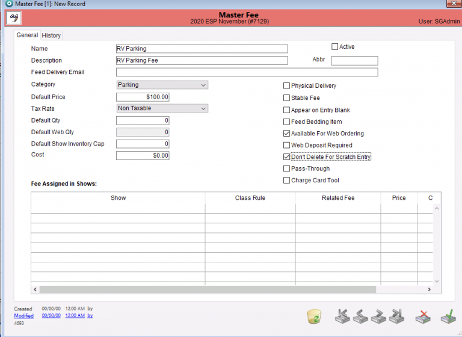
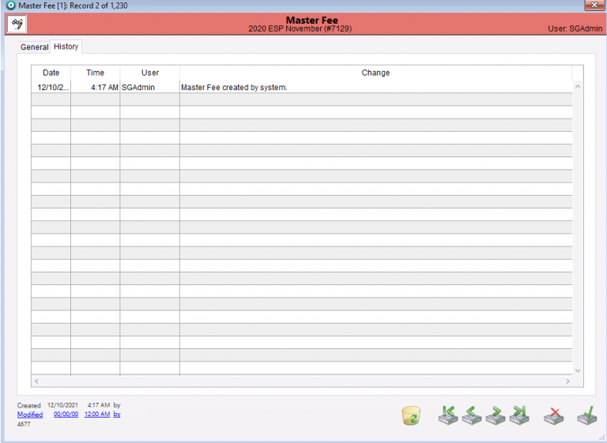

# Fees Detail

## Detail View Common Functions

All detail screens share some common elements. To review these common items please click here.

## Creating a new Master Fee

If you have a new fee that needs to be added (one you’ve never used before), the first step will be to create the Master Fee record.  Once you’ve created the Master Fee you can then include the fee in current or upcoming shows as described above. To learn how to locate the Master Fees module, click [here](../master-fees/master-fees.md).

To create a new Master Fee, Select “Add” from the top taskbar.

This will bring the user to this general tab landing page.

From here, the user will need to input the following information. The Fee name, a description of the fee, the abbreviation that they wish to be used for the fee, and the Feed Delivery email if the fee is a Feed item that will be delivered at the show by the Show Company

The Category dropdown will show the following list and the user can select the desired category for the Master Fee they are creating.

Once the user has chosen the appropriate category for their fee, they can continue filling in the remaining information needed for the Master Fee.

* The default price is filled in to be the default pricing for the Fee.
* Users can select the tax rate if it is a taxable fee from the dropdown list.
* The default quantity can be filled in and will be the default quantity for the Fee.
* The default web quantity is the default quantity associated with the Fee and will be automatically applied to the web entry.
* The default show inventory cap can be set if the show has a select number of that item available (stalls, trailer parking, tack stalls etc)
* The cost can be filled in to reflect the show companies cost for the item

**\*Note, your default quantity and default web quantity should be the same so Entries put in on the web and Entries done through the office have the same fees.**&#x20;

On the right-hand side the user can check multiple boxes that their fee is to be associated with.

**\*Note – if the default web quantity is filled in with a number, the checkbox on the right side for “Available for web ordering” will be greyed out as this is already a default web fee. If you wish to allow people to order multiple of the item, make sure the default web quantity is listed as zero.**

Once the user has all of the necessary information filled in and all the desired checkboxes are marked, they need to make sure the fee is marked as “Active”. This checkbox can be found to the right of the fee name. Only active fees will appear in the main listing of Master Fees.

Once the Master Fee is set up as desired, be sure to save the Master Fee with the green check mark in the bottom right corner of the window.

The History tab will bring users to this landing page. All of the fee history will show under this tab. Any changes that were made and which user made them.

## Creating a new Show Fee

Creating a new Show Fee is done from the Fees module.

This can be done by selecting the “Add” button on the top taskbar.

Doing that will bring users to this detail page.

From there, users will then use the dropdown list to choose which Master Fee their Show Fee will be associated with.

**\*Important every Show Fee MUST be associated with a Master Fee.**&#x20;

If a user selects an inactive Master Fee it will automatically become active again.

Once the user has selected the Master Fee that their Show Fee will be associated with, the information tied to the Master Fee will auto populate for the Show Fee (users can change this information if needed from this page, and the Master Fee will stay the same).

Users can update the Show Description, Tax Rate, Default Quantity, Default Web Quantity and the Show Inventory Cap. They can also select if they want this Show Fee to be available for web ordering with the checkbox next to the quantity boxes. Once the Show Fee is set up as desired, be sure to save the Show Fee with the green check mark in the bottom right corner of the window. Users can also edit the Master Fee from this screen by selecting the “Edit Master Fee” button on the top of the window.

**\*Note, if there is already a fee record setup for the chosen show for the Master Fee the user has selected, this popup will appear and users will NOT be able to proceed with the Show Fee they setup with that Master Fee.**

## Deleting a Show Fee

Users can delete a Show Fee record by opening the “Show Fees” module, opening a particular Show Fee and clicking the Recycle button.

A dialog box will appear confirming the user wants to delete the Show Fee record. Select “Yes” and the fee is deleted.

**\*Note, if the Show Fee is already used in Entries for the show, the fee cannot be deleted, and this warning will appear.**&#x20;

## Adding a Donation Fee

Users can now add a Donation option online for the exhibitor to fill out if they wish when creating their online entry.

To set up the Donation option, users must create a Master Fee and check the “Donation” checkbox for the fee. The Master Fee MUST have a $1.00 default price and 1 for the default quantity.

**Note,** the donation checkbox MUST be checked for the fee to show up properly on the web. If you wish to change the charity you are allowing donations for, uncheck the checkbox from the old charity, and locate the Master Fee for the new charity and check the donation box on that fee. The Master Fee must be marked as active for this feature to work.

**Note,** it’s important to set the donation fee to $1 because we change the quantity of the options that are on the web, i.e. $5 donation means it’s a $1 donation with 5 qty is added. If you set the amount to other than $1 then the qty will be multiplied with that amount.

Once the user has setup the Master Fee for the Donation, they will also have to set up a Show Fee for the Donation that is tied to the Master Fee the they just created for the Donation. Confirm the checkbox is checked for “Available for web ordering”.

Once the Master Fee and Show Fee are set up for the donation, it will show online on the entry process like this.

This option shows in the entry process after the ordering of supplies option.
