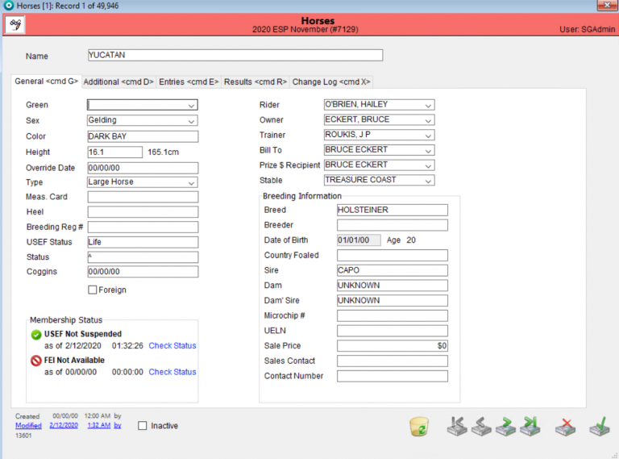
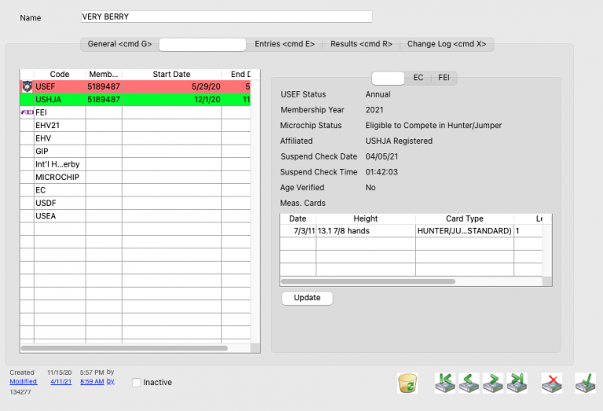
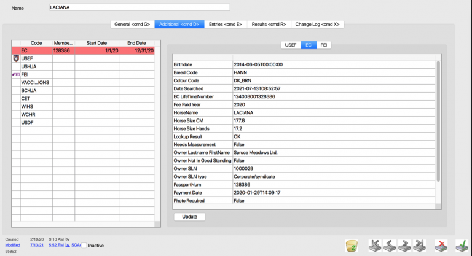
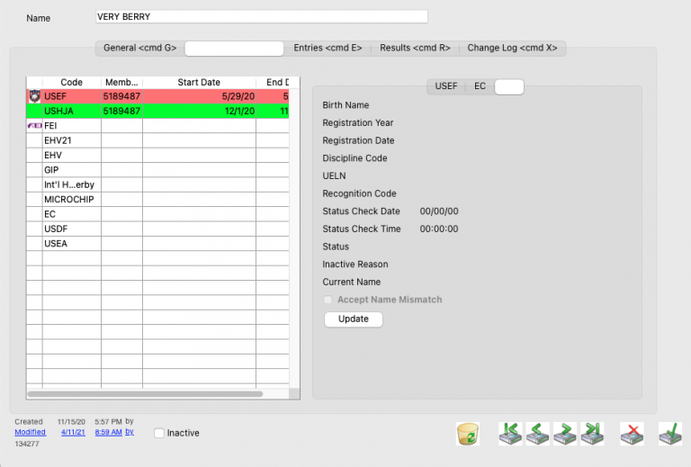

# Horses Detail

## Detail View Common Functions

All detail screens share some common elements. To review these common items please click here.

## Overview

## General Tab

Horse Info

RTO Info

### Membership Status

The Horse Status is computed from fields of information automatically, however if there is an existing override for the governing organization then the status will use the values that the user enters into the override.

To override a Horse’s status, from the Entry select the field of which you wish to override and double click. (EC, USEF, FEI etc)

The override dialog box will appear and then you can update the Horse’s status.

**\*\*\*NOTE: You MUST add a reason or the record will not save.**

Once you have saved the override, if you open the Classes tab in the Entry, the override will be noted by the status showing in yellow. This indicates that either the horse, rider, or both were modified using the Temporary Override tool.

Breeding Information

## Additional

The additional tab in the Horses module is where you will find the information regarding at the Horse’s membership statuses. You can toggle between USEF, EC, and FEI.

USEF:

EC

FEI:

## Entries

Past Entries Pane w/ Number, RTO & Show Info

## Results

Placing + Prize Money From Entries

## Change Log
