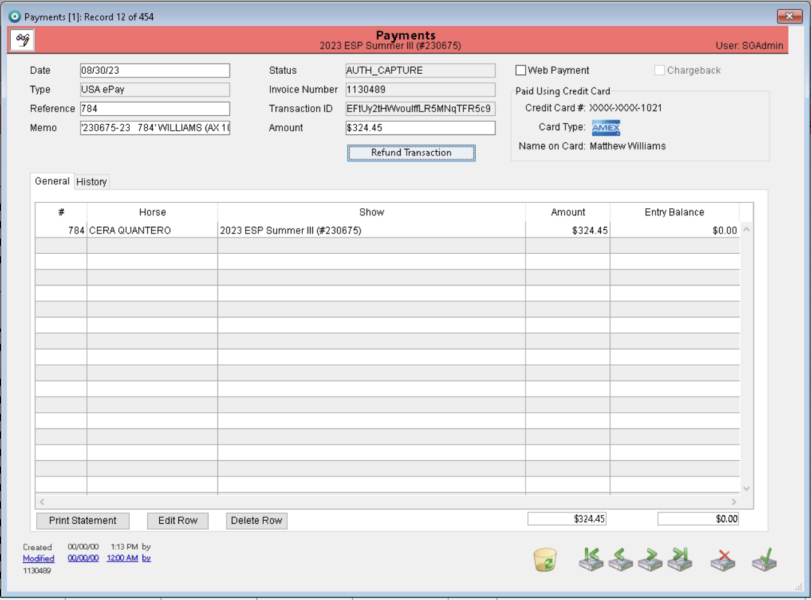
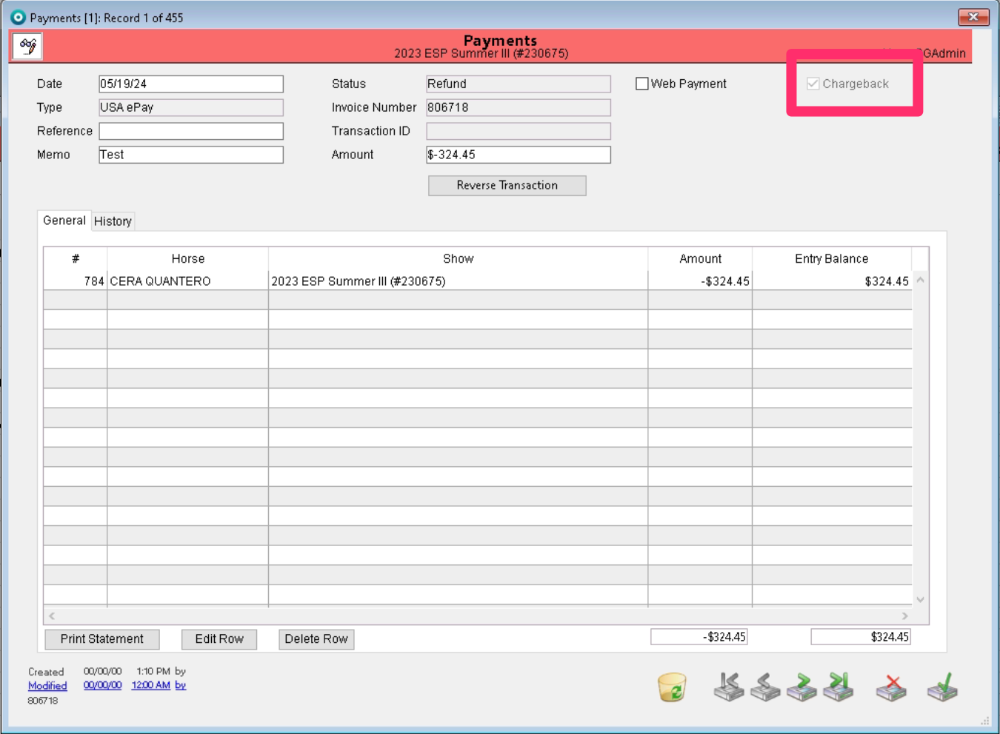

# Returned Payment- Chargeback

If a payment is disputed by the card-holder and the office needs to exhibit this in the records, the chargeback tool should be used to indicate this for the payment.&#x20;

This tool is now found in the payment record.&#x20;

Opening a payment record, you will still need to use the refund transaction button to access the chargeback.&#x20;

<figure><figcaption></figcaption></figure>

Once you open the refund transaction page, you will be able to use the chargeback checkbox.&#x20;

<figure><figcaption></figcaption></figure>

If the chargeback box is checked, you must provide a reason for the chargeback in the reason box. Once these items are completed, if the user chooses to apply, the system will ask the user for confirmation that the payment should be refunded as a chargeback.&#x20;

<figure><figcaption></figcaption></figure>

Once the user chooses OK, the payment is reversed, but not refunded. This action will show in the payment record. When a payment has been signified as being a chargeback, the chargeback checkbox in the upper right corner of the payment record will be checked off.&#x20;

<figure><figcaption></figcaption></figure>

In the entry account, the chargeback will be listed in the payment detail dialogue. Opening the specific payment detail will provide all the details of the reversed transaction.

<figure><figcaption></figcaption></figure>

The chargeback reversal is also listed in the entry history.&#x20;

<figure><figcaption></figcaption></figure>
