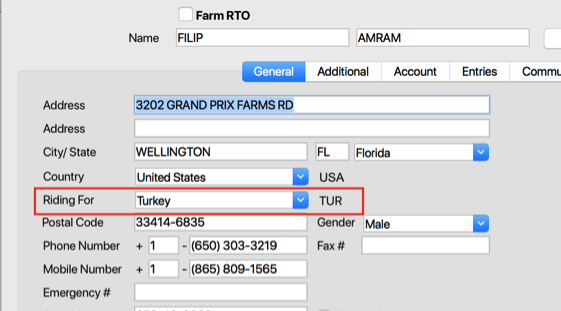
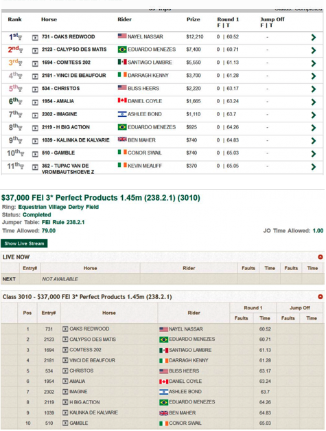
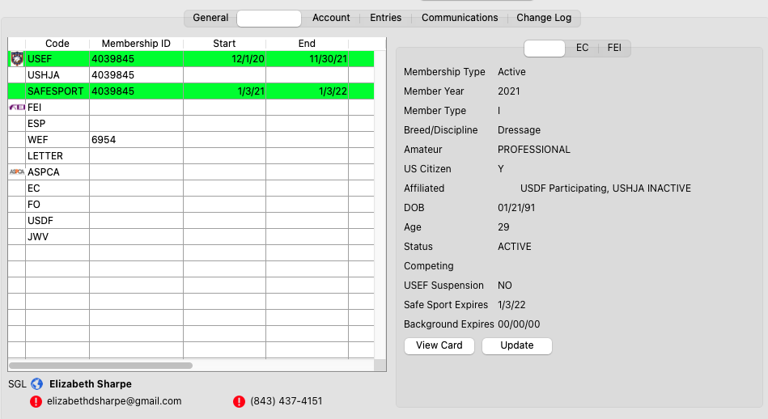
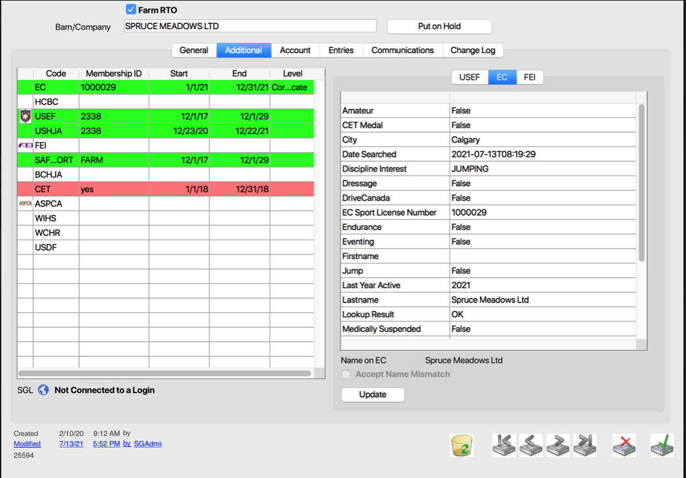
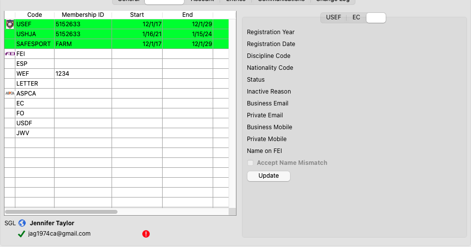

# RTO Detail

## Detail View Common Functions

All detail screens share some common elements. To review these common items please click here.

## Overview

Overview of the detail edit screen

### Notes About Medical Hold and EC

In the RTO record if someone is on medical hold, it will show on the RTO detail screen:

* When an EC lookup is done and a person is Medically Suspended, we put the RTO on Medical Hold and set the reason to EC Lookup Response.
* The system periodically runs EC lookup. If the person who was previously on EC Medically suspended list but has been cleared then the medical hold is removed.
* If the medical hold was done through office then even after clearing it from EC, the hold will not automatically remove.

On the Web:

* When a rider is added to an entry and has valid EC membership, we run EC lookup to check if the person is medically suspended in EC. In that case the person is not allowed to be added as a rider.
* If the person is already on EC Medical Suspended and gets added as a rider then we run EC lookup webservice to verify if the hold has been removed from EC. If so, then the rider can be added to the entry.
* If the person was put on Medical Hold from office then he cannot he added as rider in online entries regardless if he is on EC Medical suspension or not.

## Tabs

## General

Under the General tab, users can input and update information on the selected RTO.

**Membership Status**

Membership status is displayed on the right side of the General Tab. It will show Not Suspended, Not Available, or Not in Good Standing

### Membership Override

The Rider Status is computed from 4 fields of information automatically, however if there is an existing override for the governing organization then the status will use the values that the user enters into the override.

To override a Rider’s status, from the Entry select the classes tab and then which rider you wish to override. Then select the field of which you wish to override and double click. (EC, USEF, FEI etc)

The override dialog box will appear and then you can update the Horse’s status.

**\*\*\*NOTE: You MUST add a reason or the record will not save.**

Once you have saved the override, it will be noted by the status showing in yellow. This indicates that either the horse, rider, or both were modified using the Temporary Override tool.

### Country Flags

If a rider is riding for a country other than the one in their address, the user can select that country from the dropdown in the General tab.

If this dropdown has a value, then that is the flag that will be shown on the Order of Go, Live Class, and Results pages.

## Additional

Membership list with active/inactive color-coding for USEF,EC, and FEI Membership

USEF:

<figure><figcaption></figcaption></figure>

EC:

<figure><figcaption></figcaption></figure>

.’

We have created a new organization “EC-SAFESPORT” within the system and set the status as true. We are executing cleaner updates so all the data pulled for RTOs is the current up to date info for “ SafeSportReqCompleted”.

If the value is true for “SafeSportReqCompleted”, we will create a membership record for “EC-SAFESPORT” with membership number showing as “Yes”. The start date and end date of created membership is the same as start date and end date of EC membership.

Entries can also be verified for the “EC-SAFESPORT” memberships.

We have also updated the EC results submission process in the following ways:

* EC results export changes are made for columns 110,111,112.
  * For Column 110, Coach Fee – If there is an EC override, we check with reason code and fill the values in this column.
  * For Column 111, Self Coach declaration, we are checking with EC coach status for now. If Trainer is an active coach with EC, we fill 1, otherwise we fill 0.
  * For Column 112, Coach Name, we fill with Trainer FL Name.

FEI:

<figure><figcaption></figcaption></figure>

## Account

Under the account tab, all of the account information for the selected RTO will appear.

Users can Add Payment, Transfer/Pay Withholding Tax and Reverse IRS Payments.

Payment Batch information will show in the bottom half of the screen.

#### Voiding a Check

In order to void a check you must be viewing the Account Register under the Account tab in the RTO detail screen. In Batch Payments select which check you want to void and then select Void Selected Check.

Once the check is voided the payment amount will show as $0 and the word VOIDED will show in the payment description. The payment amount will also be credited back into the Account Register.

### Responsible Party

Under the Responsible Party tab the user can see all the information for the Responsible Party on the selected RTO.

### Prize Money Detail

The Prize Money Detail page will show all of the Prize Money Detail that the selected RTO has won. Users can also Apply Prize Money/Transfer Credits at the bottom of the window.

### Withholding Tax

Under the Withholding Tax tab the users can view all the tax that has been withheld from the selected RTO.

## Entries

The Entries tab show the list of entries that the RTO is associated with.

Users can also use the dropdown list to narrow the entries list.

## Communications

The Communications tab will show all the communication history the show company has had with the selected RTO.

## Change Log

The Change Log tab acts as a history tab for the selected RTO. Users will be able to see all the changes that have been made and who they were made by.

## Credit Holds – Setup and Use

The credit hold feature allows you to place accounts (RTO’s) on credit hold.  You can do this manually or automatically.  When an account is on credit hold, office staff will be alerted to this when working with their entries.  In addition, you can restrict what services users have access to on ShowGrounds.   The site then prompts the user to make a payment in order to be able to continue to use services on the site.

To automatically place an account on Credit Hold simply:

Find the account in RTO’s

Click the “Put On Hold” box next to the person’s name

Select the reason the RTO is being put on hold.

That’s it.  After entering the reason, notes are added to the RTO history.

### Removing an RTO from Credit Hold

If you wish to remove an RTO from credit hold, select the “Remove From Hold” button next to the RTO’s name.

A window will then popup asking you to confirm you would like to remove the selected RTO from credit hold.

### Automatically Placing RTO’s on Credit Hold

If you would like the system to manage credit holds automatically you need to first establish the rules and settings for automatic holds.  This can be done in system preferences.

### Settings

* Days before entry is past due — Placing an RTO is based on them having entries with open balances and those balances being aged by a certain number of days or more.  This is the place to set that number of days.  30 would mean it’s an open balance for a show ending more than 30 days ago.
* Past Due balance — This defines the total dollar amount that must be owed to be placed on credit hold.  This allows you to not place accounts on hold for small balances for instance.
* Automatically place RTO’s on credit hold — Account will be evaluated daily and if this checkbox is checked account set to credit hold based on the first two settings, days and age.
* Automatically remove Credit Hold — This is the opposite setting.  It will automatically remove people from credit hold when sufficient payment is made.
* E-mail Credit Hold status changes — This ensures that a person responsible for Accounts Receivable is notified whenever an account is either placed on Credit Hold or removed from it.  We highly recommend this be used.
* Accounting E-mail Address — This is the e-mail address of who should be notified.

### Credit Holds Online

Once an account is on Credit Hold, ShowGrounds can restrict their use of certain features.  Users would receive the following message when trying to access those features:

Clicking the “Pay Now” button will bring them to our standard checkout tool to make payment.

**\*Note,** If you do not wish to have your ShowGroundsLive.com site restrict users please contact support@showgroundsonline.com for us to change this in your settings for the site..
