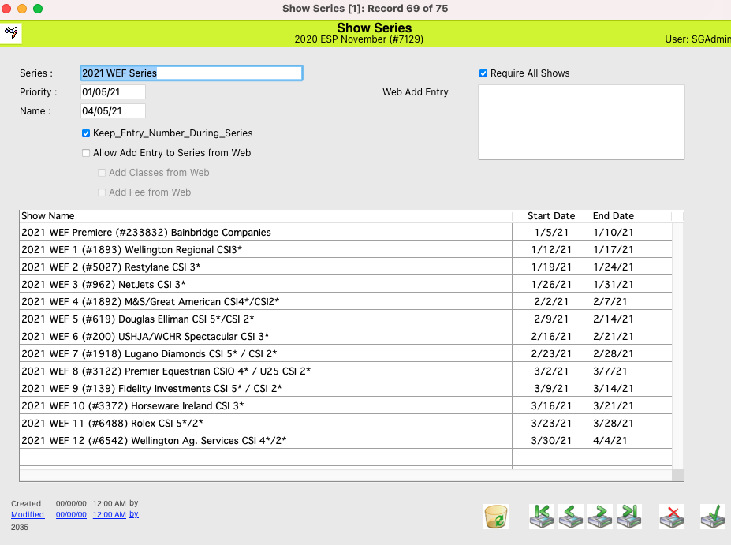

# Series Detail

## Detail View Common Functions

All detail screens share some common elements. To review these common items please click here.

## Overview

<figure><figcaption></figcaption></figure>

## Keep Entry Number During Series

If this box is checked, then the entry number for an entry will be maintained throughout all of the shows in the series.

## Allow Add Entry to Series from Web

If this box is checked, then exhibitors will have the ability to enter into all shows in the series when they are putting in Web Entries.

* Add Classes From Web: Will enable the exhibitors to add classes in the series from the web entry system
* Add Fee From Web: Will enable the exhibitors to add their fees from the web.

## Require All Shows

If this box is checked, online the exhibitor will be required to enter all shows in the series.

## Add Fee From Web

If this box is checked, exhibitors will be able to add fees from the web when entering a show. (This box should be checked if the user will be entering multiple shows that require a stall fee)
