# Shows Detail

## Overview

If you double click on a show you will be directed to the Shows Detail Page.

<figure>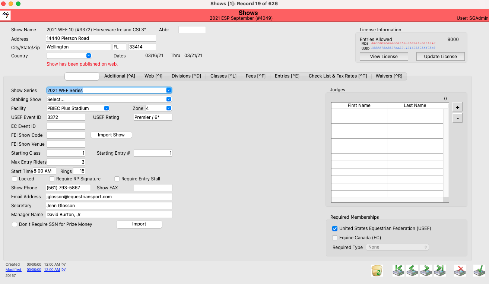<figcaption></figcaption></figure>

This portion of the detail screen will be viewable from each tab, showing the Show Name, Show Dates, and Facility Information. It also will show you whether or not the show has been published on the web. \*\*Note: If you need to update your show name or dates, you need to reach out to [support@showgroundsonline.com](mailto:support@showgroundsonline.com) with that request.

<figure>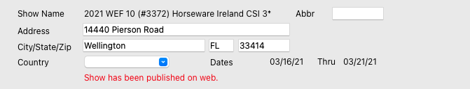<figcaption></figcaption></figure>

## General Tab

The general tab is the page you will be brought to by default when you open the detail view of your show. The following is a list of the actions you can complete from this tab.

### USEF Event ID & Rating

USEF Even ID and Rating are defined under the General tab.

<figure><figcaption></figcaption></figure>

### EC Event ID

If your event is EC Sanctioned, enter your EC Event ID here.\\

<figure>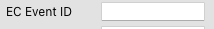<figcaption></figcaption></figure>

### FEI Integrations

<figure>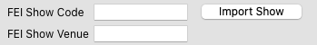<figcaption></figcaption></figure>

ShowGrounds is fully integrated with FEI and users have the ability to import FEI show information and export results. This process starts here in the Detail screen by defining the Show Code and the Show Venue. You can view the full step by step process with FEI integrations [here](http://docs.showgroundsonline.com/doc/showgrounds-manual/#7410)

### Starting Class & Entry Numbers

Starting class numbers and entry numbers are defined on this page as well. You can select any number you want to start your classes and entries (back numbers).

<figure>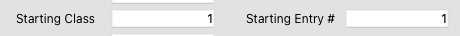<figcaption></figcaption></figure>

### Max Entry Riders

You can define how many riders are allowed to be attached to one entry here.

<figure>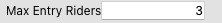<figcaption></figcaption></figure>

### Requiring Stalls for Show Entry

Show companies can require that entries have a stall to be able to enter a show. There is a checkbox in the General tab of the Show for _Require Entry Stall._&#x20;

On the Master Fee record, make sure that _Stabling Fee_ and _Available for Web Ordering_ options are selected for the stall fee. To read more about Master Fees click [here.](../master-fees/master-fees.md)

When the stall fee (or any fee that has _Stabling Fee_ checkbox enabled) is added in the entry the option to select _Trainer Stall Inventory\*_ appears. This will need to be checked within the trainer account so that the quantity of the fee will be considered as available stall inventory to use in the web entries. \*\*Note: This will only be available IF the entry is linked to a trainer account.\*\*

### Exhibitor View on the Web

Once the entries are added online, the stall quantity will be checked for within the trainer account of the selected trainer and matched with the trainer’s entries. If the inventory is not available, then the user will receive a stop in the _Review Fees_ step.

If the entry is being entered across multiple shows that require a stall, it will look like the following. The dollar amount listed will be automatically charged once the entry is completed.

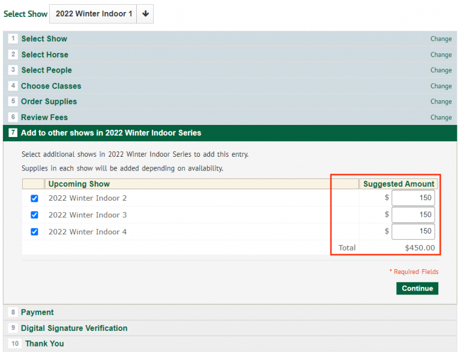

### In the Show Office

Entries can either have stalls added from their trainer account or they can add a stabling fee. This means that the entry will either A) Utilize a stall from the trainer’s available inventory or B) add the stall to the entry for them to meet the requirement of having a stall. \*\*NOTE: In the _Show Fee_ record, be sure to set an inventory cap for stalls to ensure that the stalls are not over sold.

If an entry is being added in the show office, users will see a notification on the bottom of the screen notating whether the stall they are assigning to the entry is going to be coming from a trainer’s inventory or not. They will also see the remaining inventory for that trainer account.

If the entry is not associated with a trainer and/or no stall has been added, users will not be able to continue with the entry process.

There will also be an error message if the inventory is not available.

Be sure that the “Trainer Stall Inventory” box is checked. Otherwise, the stalls won’t show as available for use.

When the office changes the stall inventory type there will be a message displayed to ensure they intended to make this change.

For setting a trainer stall.

For removing a trainer stall.

There will also be a column on the fee list view to indicate whether or not the stall is from trainer inventory. If it is, an checkmark will appear in the column marked “I” for inventory.

\*\*Note: This feature is not yet available on the iOS app so any shows with this option cannot be entered in the iOS app.

### Requiring Digital Signature from Responsible Party

Show companies may now select the option to require an e-signature from a responsible party. To read more about digital signatures click [here.](http://docs.showgroundsonline.com/doc/showgrounds-manual/#2847)

When users are adding entries into the show they will select the “Responsible Person”

The show company also will be able to tell if the RP has signed.

### Contact Information

The show’s contact information is displayed at the bottom of this screen under the General Tab. This is pulled automatically from the facility information.

<figure>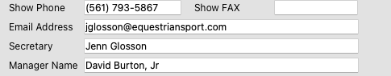<figcaption></figcaption></figure>

### Don’t Require SSN for Prize Money

By default showgrounds will not issue prize money to entries unless there is a social security number on file for the Prize Money Recipient.  By checking off this box the system will issue prize money for this show regardless of whether an SSN is on file or not.

NOTE: We treat having a Social Security Number or a Tax ID Number as the same.

### Required Memberships

You can define which memberships are required for Entries to your show, depending on where you are located.

<figure>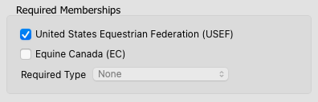<figcaption></figcaption></figure>

### Copying a previous show

Users can copy a previous show by selecting the “import” button at the bottom of the page.

The following window will popup and the user can then select which categories they wish to copy.

Once the user has chosen the desired categories to copy over, select the “copy show button” and the show will be copied.

## Additional Tab

This is the second tab in the shows detail screen. The following is a list of the actions you can complete from this tab.

### Paper Entry Closing Date

If you would like to accept paper entries and have them only be accepted through a certain date, you can define that date here.

<figure><figcaption></figcaption></figure>

## Credit Card Service Fee

We provide shows the ability to charge a service fee to entries paid by credit card.

Create a new Master Fee for the service charge. No amount needed in the price. Make the default qty 1. (need to confirm\*\*)

From the shows module in the palette, check the box for ”Charge Credit Card Service Fee”, pick the name of the fee and pick the percentage.

In the payment window, the amount to be charged is displayed.

In the account of the individual entry, the fee name will display.

## Web Tab

This is the third tab in the shows detail screen. The following is a list of the actions you can complete from this tab, these settings affect your show and how it is being displayed on your Showgrounds webpage.

### Entry Closing Date & Entry Range

Web Entry Closing Date will define which date entries will stop being accepted into the show from the web.

The Web Entry Range is the starting and ending entry numbers that will be auto-assigned to entries as they are put in on the web. Trainer account range is specifically for entries that are entered using trainer accounts, which are created automatically if none exists and the feature is enabled. Click [here](http://docs.showgroundsonline.com/doc/showgrounds-manual/#8620) to read more about automatic trainer accounts.

Disallow Add Entry to Series: if this box is checked, then anyone creating an online entry will not be able to enter into the whole series on ShowGroundsLive.com, they would have to enter each show in the series individually. If this box is not checked, then the user would be able to add their entry to all shows in the series.

Disallow Web Entries. If this box is checked, the user can put in their own message that will appear online when the exhibitor is creating their entries for the show.

If this checkbox is checked, the exhibitor will not have the option to enter the show online as the button will be grayed out, and the message input by the user will appear.

### Web Deposits

Show companies can require that upon entry exhibitors are charged a deposit, or they can elect to simply require the exhibitor to have a credit card on file.

<figure>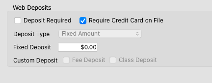<figcaption></figcaption></figure>

If the Show Company wants to require a deposit then they have the option to select a fixed amount per entry or a custom amount.

<figure>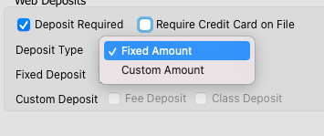<figcaption></figcaption></figure>

If you select the Fixed Amount then you can enter that amount in the box below.

<figure>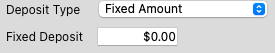<figcaption></figcaption></figure>

If you select Custom Amount then you will need to select one or both “Fee Deposit” and/or “Class Deposit”

<figure>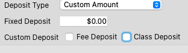<figcaption></figcaption></figure>

### Disallow Agent Signature

Trainers are, by default, able to sign waivers and such as their agent. If you want to change this, and NOT ALLOW them the ability to sign, you can select the checkbox in this tab to Disallow Agent Signature.

<figure>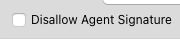<figcaption></figcaption></figure>

### Requiring a Code for Web Entry

If you would like to require a code for an exhibitor to be able to enter a show, you can add that here. Select the option to Require Web Entry Code and then you can enter whatever code you would like.

<figure>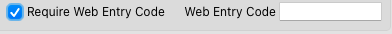<figcaption></figcaption></figure>

On ShowGroundsLive if the user does not have that code, they will not be able to enter the show.

<figure>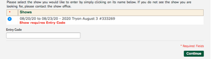<figcaption></figcaption></figure>

### Publish Show On Web

We do not publish your horse show to the ShowGroundsLive.com web site until you explicitly publish it.  To do this click the “Publish Show on Web” button

Tick through the checklist to ensure you haven’t missed any key components. You can also elect to NOT have a show announcement email go out by checking the bottom box.

Click “Publish”

Then hit “Save” (Green Check)

After a few moments your show will appear on ShowGroundsLive.com.

## Cutoff Time for Hay/Shavings Orders

Users can set the time for hay and shavings in show record under the web orders box. To read about how to utilize Showgrounds feed & delivery system click [here.](../fees/feed-delivery.md)

For shows with these settings, message will appear in add entry and order supplies once user selects a fee marked as ‘Feed Bedding Item’.

## Divisions Tab

## Classes Tab

## Fees Tab

The Fees Tab is the sixth tab and this is where you will see all the fees associated with your show.

\*Note, if you have created the show from copying a previous show, the fees may have been transferred over if you had the Fees checkbox checked. You can still edit or remove these fees even if you copied the show.

To add or remove a Show Fee. Open the show and go to the fees tab.  If you wish to remove a fee from your show you may select that fee and click the “-” button to remove it.

If you need to have a fee in your show that is not currently listed you may click the “+” to add fees from your list of Master Fees. Please note the list presented will only include those fees which are not already a part of the show.

Click to add a check mark to each fee you wish to add and click the “Add” button when done. The fees will be added to your show.

## Entries Tab

## Check List & Tax Rates Tab

## Waivers Tab

The Waivers tab is the ninth tab and you can choose to copy your waiver here or change your waiver.

If you have a different show specific waiver, adding it in the show will override your default waiver. To copy your waiver from your system preferences, click the “Copy From Preferences” button.

Once the user has the desired waiver information input they must hit the “update” button for the waiver to be active. (this note will appear once you hit “update”)

**\*Note, Waivers are set in System Preferences for the show company but if the user updates one in the show specifically then that will override the ones in System preferences.**
