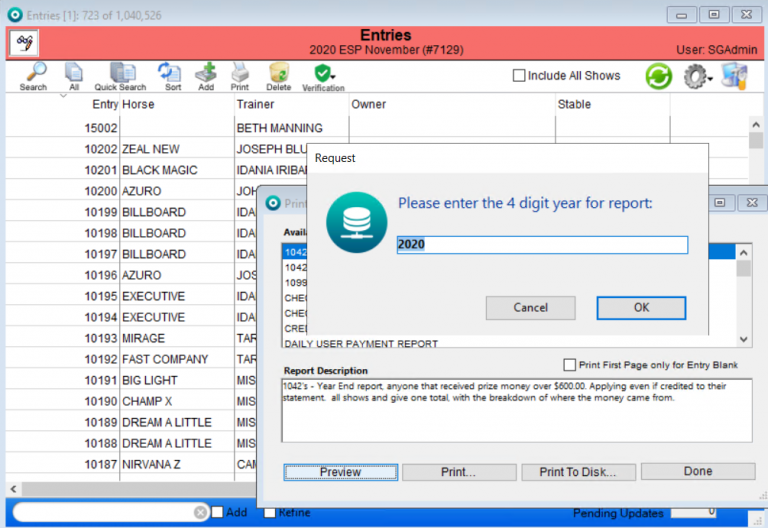
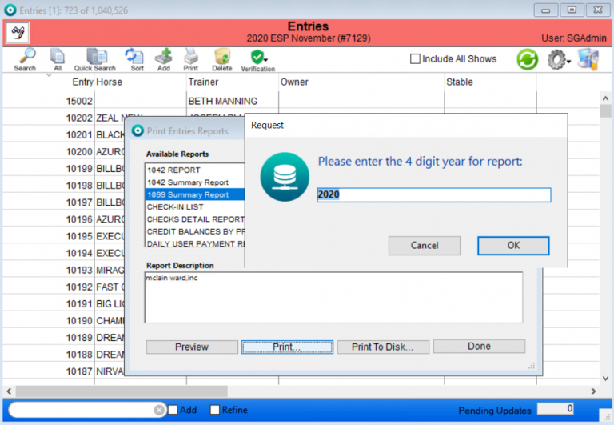

# Shows List View – Reports

## Overview

In this section we will go over the reports the user is able to create from the Shows window.

## 1042 Show Report

The 1042 Show Summary Report can be found under the “print” button on the Shows Module.

Once the user has selected the 1042 REPORT, choose print and then it will prompt the user to input the year they wish to print the report for.

Once the user hits “OK” the report will print.

**\*Note, users can also save the report to their desktop as a text file and multiple entries will appear on one page.  Select print to disk, name the file and select desktop (this last step will take a few moments as it runs all entries)**

## 1099 Show Summary Report

The 1099 report is a report of all people that received $600 or more in prize money in the year selected. The people that are on this report have either 1) won and received their prize money – ether as a credit to their balance or in the form of a check – or 2) they won and are owed the money but it was never paid to them because the show company is missing the required information; This report should only reflect the parties who have received the money, because if they have not received it then the show company is still responsible for getting them that money.

The 1099 reports can be found under the “print” button on the Shows Module.

Once the user has selected the 1099 Summary Report option, choose print and then it will prompt the user to input the year they wish to print the report for.

Once the user hits “OK” the report will then print.

1099 Reports look for Prize Money payment records applied to the entry during the year and only include those in the report.  If the payment to RTO is made in the next year, it will be reflected in that year’s 1099.

**\*Note, users can also save the report to their desktop as a text file and multiple entries will appear on one page.  Select print to disk, name the file and select desktop (this last step will take a few moments as it runs all entries)**

## EC Results Export Errors

EC Results Export Errors can be found under the “print” button on the Shows Module.

Once the user has selected the “EC Results Export Errors” option, choose print.

Once the user has done this, the report will print with the listing of the EC Export Errors.

## Owner Winnings Report

Owner Winnings Report can be found under the “Print” button on the Shows Module.

Once the user has selected the Owner Winnings Report, choose print. Once the user has done this, the following window will appear prompting the user to input the following information: how many owners by winnings.

Once the user has input the desired information, the report will show the following.

## Owner Winnings Report – All Owners

The Owner Winnings Report – All Owners can be found under the “print” button on the Shows Module.

Once the user has selected the Owner Winnings Report – All Owners, choose print.

Once the user has done this, the report will show the following.

## Ring Schedule

The Ring Schedule can be found under the “print” button in the Shows Module.

Once the user has selected the Ring Schedule report, choose print.  The following window will appear prompting the user to input the day they want the Ring Schedule for.

Once the user has input the date, the report will show the following.

## Show & Fee Dollar Cross Tab Report

The Show & Fee Dollar Cross Tab Report can be found under the “print” button on the Shows module.

## Show & Fee Qty Cross Tab Report

The Show & Fee Qty Cross Tab Report can be found under the “print” button on the Shows module.

Once the user has selected the Show & Fee Qty Cross Tab Report, choose print.

## Show Entry Count

The Show Entry Count report can be found under the “print” button on the Shows Module.

Once the user has selected the print button, the report will look like this.

