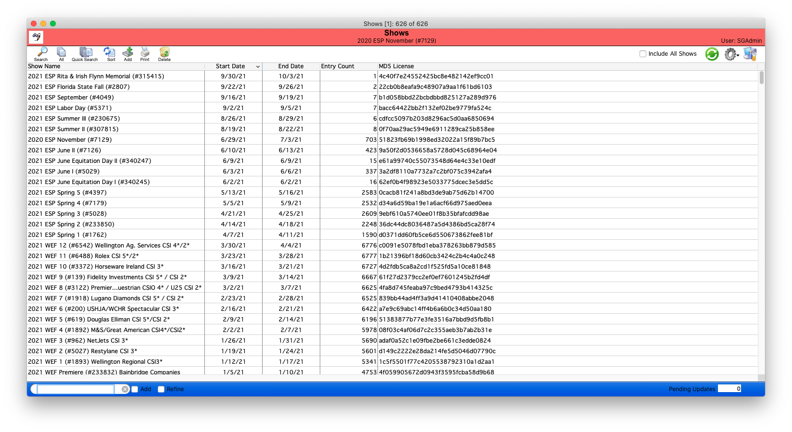

# Shows List View

## Overview

The list view for the Shows module allows you to see and filter the Shows in your database.   You also can print reports relevant to the selected Show and perform other functions from the list view.

This page will review all those options.

## List View General Functionality

Many of the basic features of our list views for any module are the same.  [**Please take a look at this article for an overview**](http://docs.showgroundsonline.com/documentation/list-views-overview/).

## Search

The show search dialog box allows you to find shows based on more specific criteria.

.png>)

## Quick Search 

### Shows This Year

Selecting this option will find all shows running in the current calendar year

### Shows Last Year

Selecting this option will find all shows running in the previous calendar year

## Print (Reports)

For a list of all reports available for Shows [click here](shows-list-view-reports.md).

## Quick Actions

For a list of all Quick Actions available for Shows [click here](shows-list-view-quick-action.md).

## Find Shows

As with all modules there are several ways to find the records you need. Each of these is listed here.

### Search Bar

In Shows, the search bar will search the following fields.

* Show Number
* Show Name
